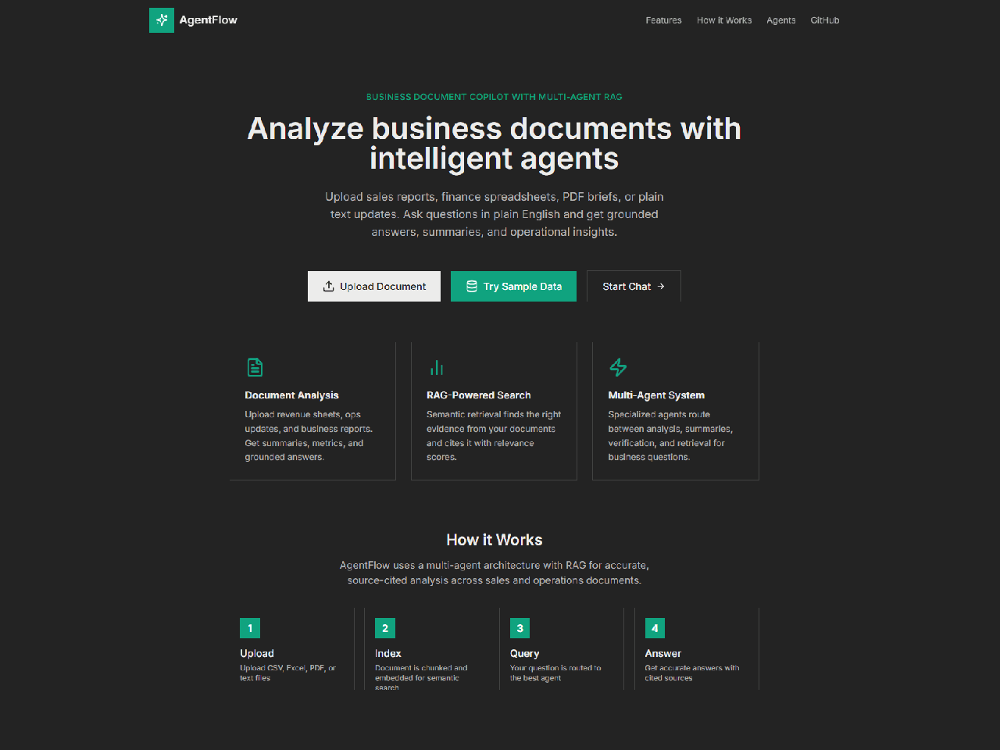
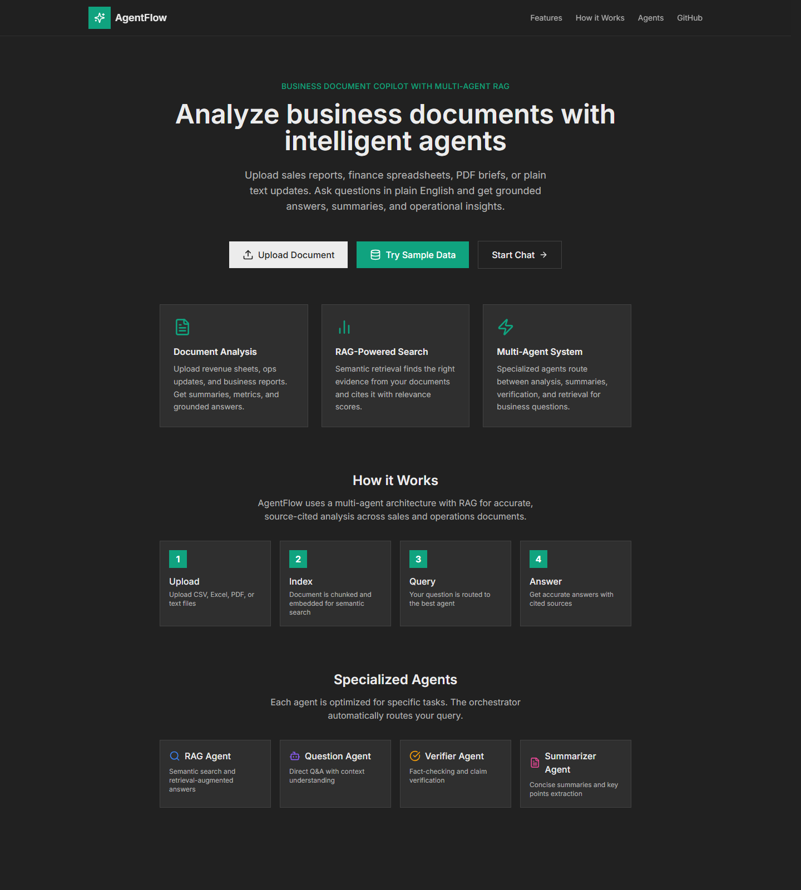
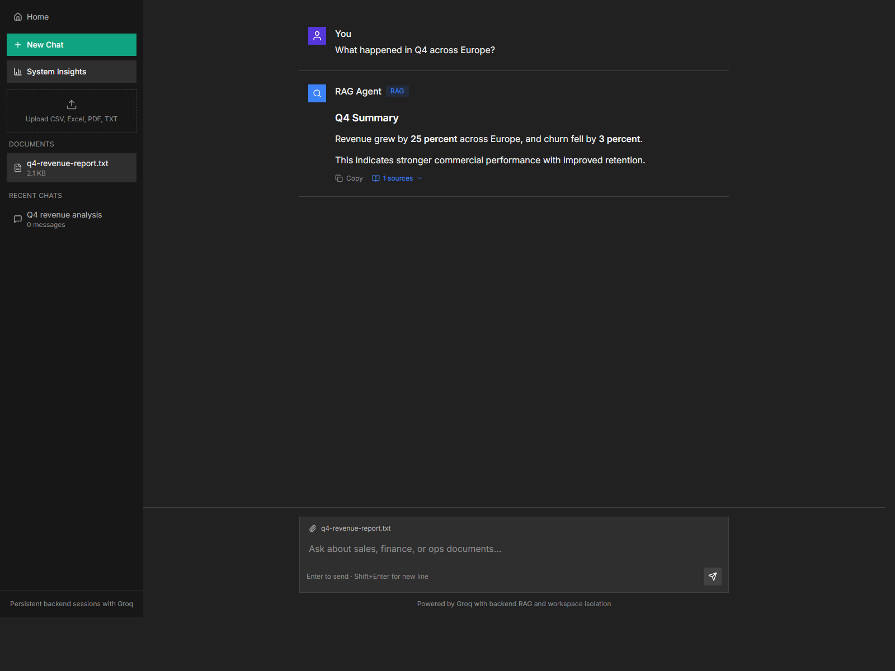
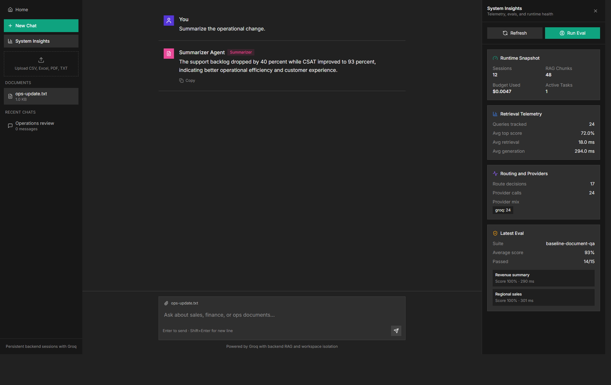

# AgentFlow

Business document copilot built as a multi-agent RAG system for sales, finance, and operations workflows.

## Why This Project Matters

AgentFlow is no longer just a generic document chatbot. It now demonstrates the parts hiring teams actually look for in applied AI engineering work:

- persistent backend state for sessions, messages, and vector chunks
- multi-agent routing across ingest, question answering, verification, summarization, and RAG
- measurable evals and telemetry instead of unverified demos
- workspace-scoped session isolation
- provider-aware backend with Groq-first inference and tracked cost/latency

This makes it a stronger portfolio project for AI Engineer, Applied AI, GenAI Engineer, and AI/ML platform-oriented roles.

## Current Status

What works today:

- persistent sessions and document storage on the backend
- persistent vector chunk storage for RAG
- Groq-backed question answering and summarization
- evaluation harness with saved run history
- telemetry for routing, retrieval, provider usage, latency, and eval summaries
- workspace-scoped access to sessions and documents
- system insights panel in the frontend for demo-friendly metrics

What is intentionally still lightweight:

- auth is not implemented
- persistence is file-backed, not Postgres-backed
- workspace isolation is header-based, not identity-backed

## Demo Assets

Animated walkthrough:



Screenshots:





## Architecture

**Full write-up (diagrams, sequence flows, deployment):** [docs/ARCHITECTURE.md](docs/ARCHITECTURE.md)

**Demo video (embed + recording playbook):** [docs/DEMO_VIDEO.md](docs/DEMO_VIDEO.md)

```text
Frontend (Next.js)
  -> Chat, sidebar, document upload, system insights panel
  -> Calls backend API with workspace-scoped headers

Backend (Express + TypeScript)
  -> Session routes
  -> Multi-agent orchestration
  -> RAG retrieval + vector search
  -> Eval harness
  -> Telemetry + Prometheus metrics

Persistence
  -> backend/data/sessions.json
  -> backend/data/vectors.json
  -> backend/data/eval-runs.json

LLM Layer
  -> Groq primary
  -> Gemini / OpenAI fallback-ready
```

## Demo Flow

Recommended local demo:

1. Open the app and create a new chat.
2. Upload a sales, finance, or ops document.
3. Ask a grounded question such as:
   - `What changed in Q4?`
   - `Which region had the highest revenue?`
   - `Summarize the operational risks for leadership.`
4. Open `System Insights` from the sidebar.
5. Run the eval suite and show:
   - latest eval score
   - retrieval latency
   - provider usage
   - routing decisions

## Key Features

- Multi-agent orchestration with an explicit orchestrator
- Persistent RAG document indexing and retrieval
- Workspace-scoped backend access model
- Eval harness for repeatable document QA checks
- Telemetry endpoint for recent route, retrieval, and provider behavior
- System insights UI for live demos
- Business-document positioning instead of a generic chatbot UX

## Deploying on Render

The backend can be deployed on Render as a Docker service.

**Data directory:** The backend tries `DATA_DIR` (if set), then `/app/data` under the app working directory, then a temp folder. So even if `DATA_DIR=/var/data` is set but that path is not writable (e.g. no disk attached), the service still starts and uses `/app/data`.

1. **Recommended for free tier / no disk:** Remove `DATA_DIR` from Render **Environment** (or leave it—fallback still works). Data lives under `/app/data` in the container (ephemeral on free tier).

2. **With persistent disk** (data survives redeploys):
   - Render Dashboard → Disks → Add Disk, mount path `/var/data`
   - Set `DATA_DIR=/var/data`
   - The Docker entrypoint attempts to fix ownership on that path when present

Required env vars: `GROQ_API_KEY`, `CORS_ORIGIN` (your frontend URL; comma-separated for prod + local).

**Custom domain (e.g. `agentflow.thedixitjain.com` on Vercel):** see [docs/CUSTOM_DOMAIN.md](docs/CUSTOM_DOMAIN.md).

## Local Setup

### Frontend `.env.local`

```env
NEXT_PUBLIC_API_URL=http://localhost:4000/api
GROQ_API_KEY=your_groq_api_key
GEMINI_API_KEY=your_gemini_api_key_here
```

### Backend `.env`

Optional. The backend also reads the repo-root `.env.local`.

```env
PORT=4000
DATA_DIR=./data
GROQ_API_KEY=your_groq_api_key
OPENAI_API_KEY=your_openai_api_key
DAILY_BUDGET=10
CORS_ORIGIN=http://localhost:3000
```

### Run

```bash
npm install
npm run dev
```

In a second terminal:

```bash
cd backend
npm install
npm run dev
```

If `3000` is already occupied, Next.js may start on another port such as `3002`.

## Important Endpoints

Core:

- `GET /api/sessions`
- `POST /api/sessions`
- `GET /api/sessions/:id`
- `POST /api/sessions/:id/documents/parsed`
- `DELETE /api/sessions/:id/documents/:documentId`
- `POST /api/sessions/:id/chat`
- `POST /api/sessions/:id/chat/stream`

Observability:

- `GET /api/stats`
- `GET /api/telemetry`
- `GET /api/metrics`

Evaluation:

- `GET /api/evals/suites`
- `GET /api/evals/runs`
- `POST /api/evals/run`

## Evaluation and Telemetry

Evaluation runs are saved to:

- `backend/data/eval-runs.json`

Persistent runtime data is saved to:

- `backend/data/sessions.json`
- `backend/data/vectors.json`

Tracked metrics include:

- route selection counts
- retrieval latency and top-score quality
- provider request counts, fallbacks, token usage, and cost
- eval suite runs and per-case scores

## Portfolio Highlights

The strongest talking points for interviews are:

- moved the app from browser-local state to persistent backend sessions and vectors
- added a measurable eval harness instead of relying on subjective demos
- instrumented routing, retrieval, provider, and cost behavior for observability
- introduced workspace-scoped isolation and log redaction as practical security steps
- reframed the app around business document intelligence, improving product clarity

## Resume Bullets

Copy-ready bullets live here:

- [docs/RESUME_BULLETS.md](docs/RESUME_BULLETS.md)

## Demo Shot List

Suggested screenshots / GIF sequence lives here:

- [docs/DEMO_SHOTLIST.md](docs/DEMO_SHOTLIST.md)

## Tech Stack

- Next.js 14
- React + TypeScript
- Express + TypeScript
- Groq SDK
- Gemini SDK
- Recharts
- Prometheus client

## License

MIT
