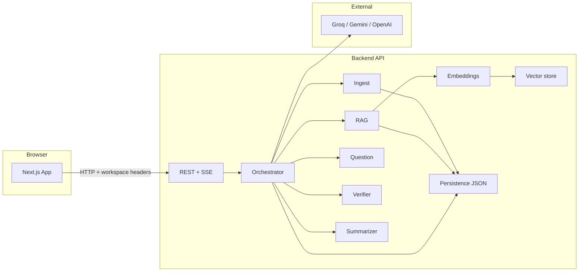
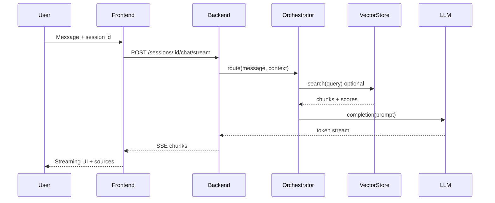
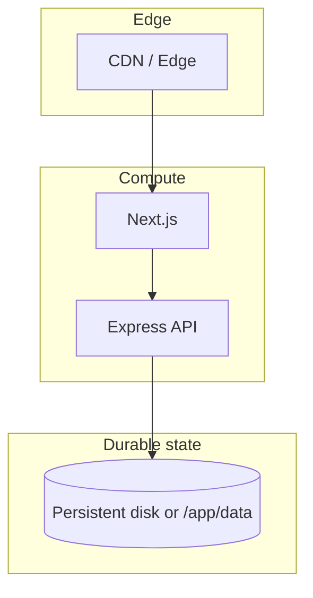

# AgentFlow — System Architecture

Production-oriented reference for how the product is structured, how data flows, and where to extend it.

## High-level overview

AgentFlow is a **multi-agent RAG (retrieval-augmented generation) document copilot**: a Next.js frontend talks to an Express/TypeScript backend that orchestrates specialized LLM agents, embeddings, and file-backed persistence.

## Layers

| Layer | Responsibility | Tech |
|--------|----------------|------|
| **Presentation** | Landing, chat, insights, uploads | Next.js 14, React, Tailwind |
| **API surface** | Sessions, chat (incl. streaming), documents, evals, metrics | Next route handlers + Express `/api/*` |
| **Orchestration** | Route user intent to the right agent | `orchestrator.ts` |
| **Agents** | Ingest, RAG retrieval, Q&A, verification, summarization | TypeScript modules per agent |
| **Retrieval** | Chunking, embeddings, cosine similarity search | `embeddings.ts`, `vectorStore.ts` |
| **Persistence** | Sessions, messages, vectors, eval runs | JSON files under configurable `DATA_DIR` |
| **Observability** | Logs, telemetry, Prometheus metrics | Winston, `telemetry.ts`, `/metrics` |

## Request flow (chat)

1. User sends a message (optionally scoped to a document).
2. Backend loads session + document context from persistence.
3. **Orchestrator** decides which agent path to use (RAG vs direct question vs summary, etc.).
4. For RAG: **embeddings** encode the query; **vector store** returns top-k chunks; LLM answers with grounded context.
5. Response may be **streamed** (SSE) to the client; sources and agent type are attached for the UI.

## Data model (logical)

- **Session**: id, workspace id (header), messages, document references, timestamps.
- **Document**: parsed text or tabular rows, metadata (name, type, size).
- **Vector chunk**: embedding vector + text + document id + chunk index.
- **Eval run**: suite id, scores, timestamps (for regression-style checks).

Physical storage is **JSON files** (not Postgres) by design for the portfolio/demo; swapping to a database is a bounded change at the persistence boundary.

## Workspace isolation

Clients send a **workspace header** (see `api.ts`). The backend scopes session lists and operations so multi-tenant demos don’t leak data across “workspaces.” This is **not** full auth—pair with real identity for production.

## Deployment topology

Typical split:

- **Frontend**: Vercel / static host / container; needs `NEXT_PUBLIC_API_URL` pointing at the API.
- **Backend**: Render / Fly / etc.; needs `DATA_DIR` writable (see README), LLM keys, `CORS_ORIGIN`.

## Security & operations (prod checklist)

- [ ] Secrets only in environment variables (never in repo).
- [ ] Replace header-only workspace model with real authentication if exposing beyond demos.
- [ ] Rate limiting is configured on the API; tune for your traffic.
- [ ] Redaction in logs for API keys/tokens (see `logger.ts`).
- [ ] For durable file persistence on PaaS: attach a disk or use object storage / DB.

## Extension points

- **New agent**: add module under `backend/src/agents/`, register in orchestrator.
- **New provider**: extend `llm.ts` / config.
- **Stronger retrieval**: swap vector store for pgvector, Pinecone, etc., behind the same interface.
- **Auth**: middleware on Express + session/JWT; propagate user id into workspace/session layer.

---

*Last updated: aligned with the repository layout (`backend/`, `src/`).*
